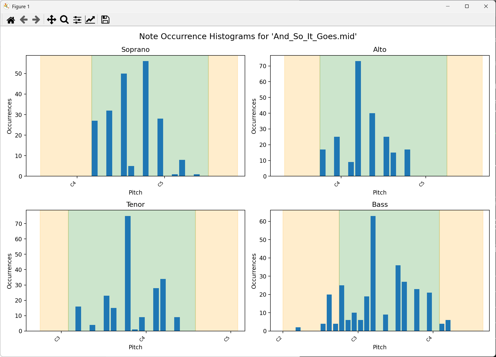

# midiplot

A small CLI tool for visually checking whether each voice part in a MIDI file is within acceptable bounds. Useful when arranging music for choirs, for example.

* `pip install -r requirements.txt`
* `python plot.py my_midi_file.mid`

Example output:

